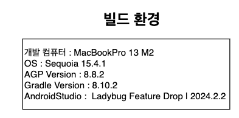
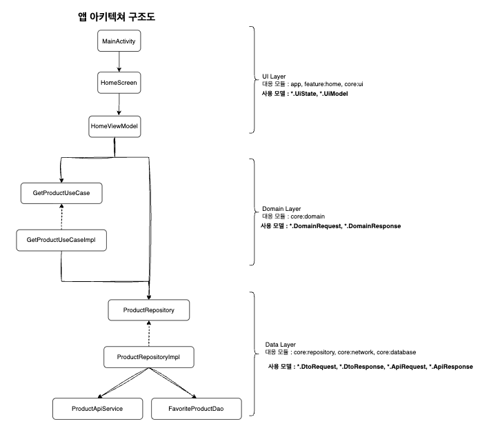
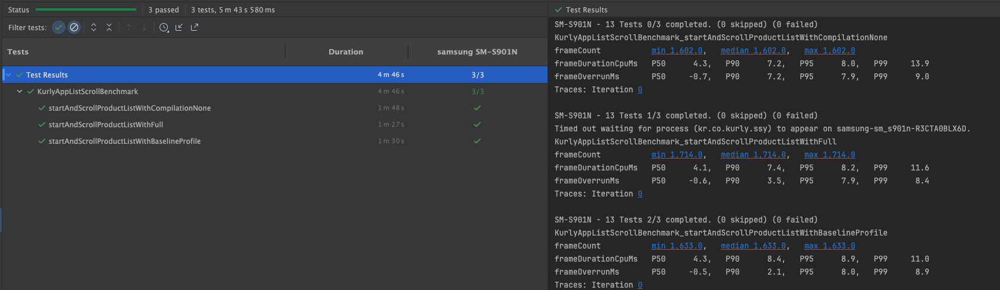
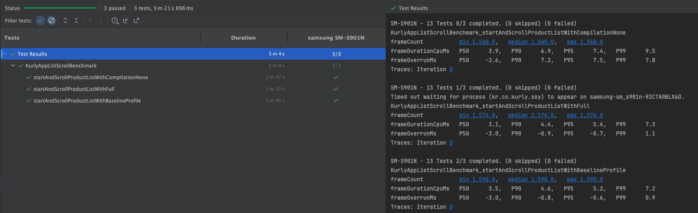

# 25.04.18 ~ 25.04.25 송상윤 과제 보고서

## 목차
1. 개요
2. 빌드 환경
3. 아키텍처 구조도
4. 테스트 케이스
5. BaselineProfile 성능 측정 결과

## 1. 개요
해당 readme.md는 과제를 검토하는 면접자분들의 검토 용이성을 위해 작성한 문서입니다. 목차는 크게 3가지로 나뉘며, 해당 과제가 수행된 '빌드 환경', '아키텍처 구조도'
, '테스트 케이스'와 마지막으론 스크롤 성능 개선을 위해, BaselineProfile을 시도한 결과 지표입니다.

## 2. 빌드 환경
해다 과제가 실행된 빌드 환경을 의미합니다. 만약 과제 빌드에 문제가 있을 시, 아래 빌드 환경을 참고하시면 좋습니다.

## 3. 아키텍처 구조도
해당 과제가 실행된 아키텍처 구조입니다. **Android공식 아키텍처**를 사용했으며, UI Layer, Domain Layer, Data Layer에 따라 앱을 구조화 하였습니다.
또한 각 Layer에는 해당 Model들이 존재합니다. (eg., *.DomainResponse, *.DtoResponse...)

## 4. 테스트 케이스
해당 과제가 수행된 테스트 케이스로써, UI 테스트와 비즈니스 로직 단위 테스트를 진행하였습니다.

| 구분     | 테스트 영역            | 테스트 수행 클래스            | 테스트 메서드                                      | 통과 여부 |
|--------|-------------------|-----------------------|----------------------------------------------|-------|
| UI 테스트 | HomeScreen        | HomeScreenTest        | whenFirstUiLoading_thenShowNoneTypeUi        | o     |
|        |                   |                       | whenFirstUiLoaded_thenShowLoadedTypeUi       | o     |
|        |                   |                       | whenClickedProductItem_thenChangeMarkedState | o     |
|        |                   |                       | whenScrolledToEnd_thenLoadNextPage           | o     |
| 단위 테스트 | HomeViewModel     | HomeViewModelTest     | whenAppFirstLoading_thenSetNoneType          | o     |
|        |                   |                       | whenAppFirstLoaded_thenSetLoadedType         | o     |
|        |                   |                       | whenLoadedTypeIsSet_thenItemsIsAtLeastOne    | o     |
|        |                   |                       | whenTriggerProductMark_thenChangeState       | o     |
|        | ProductRepository | ProductRepositoryTest | whenTriggerProductMark_thenChangeState       | o     |

## 5. BaselineProfile 성능 측정 결과
홈 화면의 성능 개선을 위해 BaselineProfile 생성 후, 벤치마크를 측정한 결과입니다.

**[추가 분석]**
frameOverrunMs가 음수가 아닌 양수입니다. 이는 1 frame의 렌더링 시간이 16ms보다 크다는 의미입니다. 개선을 위해, Composable함수들을 점검해봤으나,
음수로 만들지는 못하였습니다. 다만, '이미지 로딩'에서 개선 포인트가 있다는걸 알게됐고, 이미지 로딩하는 부분을 제거한 후, 벤치마크 측정했으며 그 결과는 아래와 같습니다.

이미지를 제거했을 경우, AOT컴파일 기준 1 frame 렌더링 초과 시간이 약 1ms로 성능이 크게 개선됐고, 이미지가 큰 영향을 준다는 것을 알 수 있습니다. 
또한 금년도 06월 17일날 Android Droid Nights 연사자로 참여합니다. 연사 주제로 'Benchmark와 Baseline Profile을 활용한 LazyColum의 성능 개선'을 선택했는데요. 
따라서 coil을 활용한 이미지 렌더링 부분 또한 추후 깊이 파볼 예정입니다.
